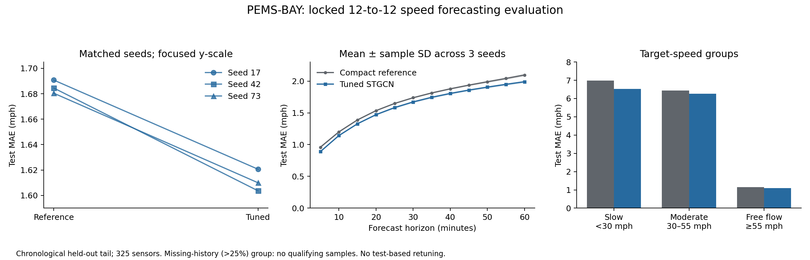
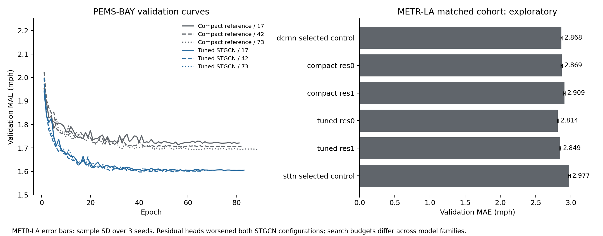

# Traffic forecasting: final research and MLE report

This project reproduces and extends the forecasting workflow associated with the **2024 CASIA internship**. The measurements below come from the subsequent reproducibility study; original internship measurements are not available for these benchmarks. The contribution is a reproducible modeling and engineering workflow built on LibCity architectures; no new STGCN or Transformer architecture is claimed.

## Question and primary result

Can a bounded, validation-selected STGCN configuration improve 12-step traffic-speed forecasting while exposing its compute cost and failure modes? Inputs are 12 five-minute readings and outputs are the next 12, in mph.

On the reserved chronological PEMS-BAY test tail, mean MAE across seeds17/42/73 fell from **1.685255 ± 0.005201 to 1.611418 ± 0.008581 mph**, a **4.381% reduction**. The ± values are sample standard deviations across training seeds, not confidence intervals. Each matched seed improved. The tuned model is substantially larger: **637,516 versus35,940 parameters (17.74×)**. This supports an accuracy/cost trade-off, not a parameter-efficient improvement.

[Unrounded test table, subgroup metrics and uncertainty](evidence/final_study/final_pems/summary.json) · [Per-seed source hashes](evidence/final_study/final_pems/trial_metrics.csv) · [Frozen selection](evidence/final_study/pems_test/locked_selection.json)

## Evaluation validity

- Chronological70/10/20 split; every12-to-12 window is contained in its own partition. No random time split or crossing target boundary.
- The scaler uses finite positive training observations only. Nonpositive/nonfinite speeds are missing, with explicit history and target masks; normalized zero is not used as a missingness proxy.
- Raw naive PEMS timestamps are interpreted in America/Los_Angeles and converted to UTC; the spring DST jump is not treated as a sensor outage. Sensor order and graph/data hashes are checked.
- The road-distance graph is fixed, not learned from held-out target values. STGCN uses max(A,Aᵀ); directed graph handling for DCRNN/STTN remains separately documented.
- Primary selection is the equal mean of12 horizon MAEs. PEMS horizon counts were equal, so the historical pooled MAE used during local training produced the same ranking; this equivalence was checked over all screen epoch histories.
- Models use train/eval modes, masked loss, train-only normalization and inference without future labels. Model, optimizer, scheduler, random state and early-stopping state are checkpointed.
- Final model/configuration/weight hashes and evaluation-source hash were frozen before test scoring. No retuning followed test results. Existing local/server records plus the user's explicit no-external-test-use attestation support PEMS test independence; deleted or unknown external records cannot be technically ruled out.
- METR-LA had previously inspected tests and remains **exploratory**. Its validation comparisons are not independent-test evidence. Old single-step MAEs are a different task.

## Search and attribution

PEMS used13 configurations (one compact reference plus12 bounded candidates), seed17 screening and seeds42/73 replication. Observed search values: Ks2/3/4; Kt2/3; block widths8/16 through64/128; dropout0/.1/.2/.3; learning rate1e-4/3e-4/1e-3/3e-3; weight decay0/1e-5/1e-4/1e-3; batch16/32/64. This was not the full Cartesian grid. Exact configurations and every completed screen score are published.

Two ST blocks contain four unpadded temporal convolutions, requiring12−4(Kt−1)>0. Kt2/3 satisfy the constraint; dimension-invalid configurations are rejected before training. The selected candidate005 uses Ks4, Kt2, blocks[1,64,128]/[128,64,128], dropout.1, Adam learning rate3e-4, weight decay0 and batch32. Reference uses Ks3, Kt3, blocks[1,8,16]/[16,8,16], dropout0, learning rate.003 and batch16. Both use the direct multi-step head. Their joint difference does not isolate any one hyperparameter or the direct head itself.

PEMS budgets were180 maximum epochs, minimum40 and patience25. Actual reference lengths were81/82/89 epochs; candidate83/66/70. Selected epochs were56/57/64 and58/41/45, respectively. More epochs are not the claimed source of improvement. Candidate seed73 completed within its independent8-hour wall cap. Seed17 is selection-involved, so replication and fresh test evidence carry different evidential weight.

[Screen protocol](../../configs/forecasting/local_pems_stgcn_mps_screen_v1.json) · [13 screen results](evidence/final_study/pems_screen_results.json) · [Validation histories](evidence/final_study/pems_training)

## Matched ablations and negative results

The18-run METR-LA V100 cohort compared six configurations on seeds17/42/73, with the same100-epoch maximum/minimum30/patience20 protocol. Tuned STGCN without the last-speed residual achieved2.813788±.005083 validation MAE versus compact2.869269±.009284 (1.934% lower). Adding a missing-aware last-valid-speed residual worsened both configurations: compact2.908631, tuned2.849414. All matched residual comparisons worsened. The residual hypothesis was therefore rejected for this cohort.

DCRNN reached2.868116±.008061 and STTN2.977292±.014552. STGCN had a broader historical search; DCRNN's six completed candidates and STTN's reference-only selection do not justify an equally optimized architecture ranking. Historical A100 results informed selection; fresh V100 trials supplied matched comparisons. No cross-device checkpoint migration is counted as an exact replicate.

The separate **speed-only STAEformer adaptation** completed11 trials. Adaptive embedding:2.807334±.006859; static spatial embedding:2.792865±.003029; zero embedding:3.194011±.001393. Static spatial embeddings slightly outperformed adaptive ones, while removing embeddings harmed validation. Parameter counts differ, so this is not an isolated proof about embedding expressiveness. The implementation omits calendar covariates and is not an exact reproduction of the published SOTA setting. The three-candidate screen used a within1% validation tolerance followed by inference-cost choice; its operational details were formalized after screen results, limiting a strict preregistration claim.

[Matched cohort report](evidence/final_study/matched_core_validation/report.md) · [STAEformer individual results](evidence/final_study/staeformer_validation.json)

## Error analysis and uncertainty

Tuned/reference mean test MAE:15min1.3283/1.3888,30min1.6719/1.7380,60min1.9898/2.0961mph. Slow traffic remains difficult:6.5272/6.9913mph below30mph, compared with1.0949/1.1479 in free flow. These target-defined groups describe errors, not a causal congestion effect. There are **zero eligible observations** for the >25% missing-history subgroup; it is N/A, not zero error or evidence of missing-data robustness.

Persistence and moving-mean test MAEs are2.169196 and2.751034mph. For the preselected representative seed42,5000 paired daily-block resamples over37 chronological blocks give a candidate-minus-reference MAE interval[-.093002,−.068785]mph. This is conditional temporal uncertainty for these weights and this period. It is distinct from three-seed variation, assumes daily blocks adequately approximate dependence, and includes a final partial block. It does not establish cross-city or future-year generalization. Temporal diagnostics were specified after aggregate evaluation and are supplemental, not a preregistered significance test.

## Engineering, serving and cost

Atomic checkpoints, per-trial locks, frozen source/data/hardware identities, bounded time-limit requeue and terminating/reaping the actual child writer make interruptions recoverable. A separate synthetic interruption check verified restoration of model/optimizer/scheduler/RNG. Checkpoint storage routing reduced observed I/O overhead without changing numerical code; heterogeneous hardware speed checks remained diagnostics, not model selection by test score. The final matched server cohort took11h11m elapsed across overlapping allocations, totaling19h23m GPU allocation time; these are separate from timed train/validation-loop cost.

The selected seed42 serving artifact contains weights, scaler, graph, ordered sensor IDs and source fingerprints. Its JSON interface validates exact shape[B,12,325,1], timestamp cadence, sensor order, units and missing values, and loads the model once. CPU/MPS reload parity was exact on the checked training history. This is an offline service prototype, not a production deployment or robustness proof for all inputs.

| M4 Pro FP32 in-process p50 | Reference | Tuned |
|---|---:|---:|
| CPU batch1 |3.784ms|20.061ms|
| CPU batch16 |71.657ms|295.594ms|
| MPS batch1 |4.283ms|15.358ms|
| MPS batch16 |63.983ms|84.126ms|

Timing uses3 warmups and10 synchronized repetitions on a repeated training history, including validation/preprocessing/forward/transfer/list conversion; it excludes HTTP transport and JSON encoding. Small-sample microbenchmarks are not production latency guarantees. Three-seed timed training/validation totals were3.544h reference and11.634h tuned, excluding checkpoint/setup/queue costs and the rest of the search. [Raw latency samples](evidence/final_study/serving)

## Personal contribution and scope

The defensible personal contribution is the audited temporal pipeline, validation-only bounded search, direct multi-horizon integration, tested missing-aware residual hypothesis, matched ablations, recovery/privacy engineering, and train-serving-consistent artifact/interface. STGCN/DCRNN/STTN/STAEformer are prior architectures. Negative results informed choices; no novel architecture, RL capability, SOTA result, online deployment or congestion reduction is claimed.

[Reproduction and artifact usage](REPRODUCE_FINAL_STUDY.md). Source architectures: [STGCN](https://arxiv.org/abs/1709.04875), [DCRNN](https://arxiv.org/abs/1707.01926), [STAEformer](https://arxiv.org/abs/2308.10425), and LibCity's attributed implementation. Dataset and preprocessing differ from some published settings, so paper leaderboard numbers are not directly compared.
