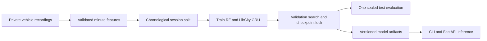

# CASIA Traffic Forecasting — Machine Learning & Deep Learning

**Audit temporal data, compare spatiotemporal models, and ship reproducible forecasting artifacts.**

An internship-derived traffic analytics project with reproducible Random Forest, LibCity SVR/FNN/GRU comparisons, a validated FastAPI inference service, and a public **METR-LA graph and Transformer forecasting** study. The internship-recording task predicts next-minute mean vehicle speed; the public Los Angeles task predicts 5-minute-ahead speed at 207 road sensors. [Model selection](docs/forecasting/MODEL_SELECTION.md) · [METR-LA protocol and model results](docs/forecasting/METR_LA_STUDY.md).

## Completed multi-horizon study — independent PEMS-BAY evaluation

This study extends the forecasting workflow associated with the **2024 CASIA internship**: 12 past five-minute speed readings predict the next 12. In the documented reproduction, validation-selected STGCN tuning reduced held-out PEMS-BAY MAE from **1.6853 to 1.6114 mph (4.38%)** across three matched seeds. The tuned model uses 17.74× more parameters, so accuracy is reported with its compute and latency costs. METR-LA matched ablations and a speed-only STAEformer adaptation provide exploratory validation comparisons. These measured results come from the subsequent reproducibility study; original internship benchmark results are unavailable.

[Final research report](docs/forecasting/FINAL_STUDY.md) ·
[Reproduce and serve the selected model](docs/forecasting/REPRODUCE_FINAL_STUDY.md) ·
[Exact test evidence](docs/forecasting/evidence/final_study/final_pems/summary.json) ·
[Research figures](docs/forecasting/figures/pems_locked_test.png)

Historical [multi-horizon protocol](docs/forecasting/MULTIHORIZON_STUDY.md),
[workflow decisions](docs/forecasting/MLE_WORKFLOW_V2.md) and
[audit](docs/forecasting/DEEP_AUDIT.md) remain available for provenance.
Earlier single-step scores below belong to a different task.

## Public Los Angeles traffic forecasting: STGCN, DCRNN, and STTN

Using the public 34,272-timestamp METR-LA speed series and road graph, I reproduced LibCity's Chebyshev **STGCN**, diffusion-convolutional **DCRNN**, and spatial-temporal Transformer **STTN** for 207-sensor 5-minute speed prediction. A chronological 70/10/20 split, train-only scaling, 30-epoch validation tuning, and a missing-aware last-available-speed baseline make the evaluation inspectable. On **6,843 later test windows** covering 1,244,780 valid sensor targets, STGCN achieved **2.247 mph MAE**, DCRNN **2.263 mph**, and validation-selected STTN **2.430 mph**, versus **2.815 mph** for the baseline. STGCN had the lowest validation and test MAE of these three families; its test MAE was **20.18%** below persistence. Earlier test scores from the same period had already been inspected, so these are exploratory offline results, not a prospective blind test, original-paper scores, or live congestion improvements.

The repository fixes DCRNN's sparse graph coordinate/value alignment and cross-support diffusion state, stabilizes and batches STTN graph propagation, adds opt-in residual heads, and publishes tested candidates, checkpoints, and [graph-model validation curves](docs/forecasting/metr_la_learning_curves.png). For STTN, a last-observed-speed residual reduced compact-model validation MAE from **2.289 to 2.244 mph (1.95%)**; a wider, deeper version reached **2.240 mph** validation MAE but did not beat STGCN on the later test period. [Full protocol, limitations, and reproduction](docs/forecasting/METR_LA_STUDY.md) · [Graph metrics](docs/forecasting/metr_la_report.json) · [STTN metrics and 90-epoch audit](docs/forecasting/metr_la_sttn_report.json).


## Measured results

Chronological recording-level split: **6,418 source vehicle rows → 132 training / 82 validation / 112 test windows**. The final two recording sessions were held out; all model selection used validation only. ML/DL scores are means over seeds 17, 42 and 73.

| Model | Test MAE, km/h ↓ | Test RMSE, km/h ↓ | MAE improvement vs own baseline |
|---|---:|---:|---:|
| Persistence | 7.201 | 9.336 | — |
| Four-minute moving mean | 5.365 | 7.125 | — |
| Random Forest baseline | 6.270 | 8.026 | — |
| Regularized residual Random Forest | **5.362** | 7.120 | **14.49%** |
| LibCity GRU Seq2Seq baseline | 6.067 | 7.748 | — |
| Compact mean-residual GRU | **5.312** | **7.077** | **12.44%** |

The tuned GRU uses **609 parameters vs 26,369 (97.69% fewer)**. Its MAE seed standard deviation fell from 0.630 to 0.021 km/h on this benchmark. The simple moving mean is already strong: the GRU improves on it by only **0.97%**. This small retrospective study does not establish deployment impact or statistical superiority on other roads.

**LibCity catalog extension:** We reproduced the repository's SVR and FNN baselines for the same speed target. The opt-in two-layer mean-residual FNN reduced later-session MAE from **6.435 to 5.480 km/h (14.84%)** versus its own untuned baseline, using 817 versus 2,305 parameters. It did **not** beat the 5.365 moving mean or 5.312 compact GRU. A validation-selected linear SVR worsened later-session MAE from 5.497 to 6.374; that failure is reported rather than hidden. The earlier test sessions had already been inspected, so these are exploratory retrospective comparisons. [Model-by-model method and results](docs/forecasting/MODEL_SELECTION.md) · [SVR/FNN search](docs/forecasting/catalog_selection.json) · [SVR/FNN report](docs/forecasting/catalog_test_report.json)

**Architecture ablation:** A direct one-step GRU head removed the autoregressive decoder and was tuned over six hidden-size/residual-scale settings, using the same three seeds and validation sessions. Its best validation MAE was **6.020 km/h**, versus **6.111** for the selected compact Seq2Seq GRU, but its retrospective test MAE was **5.558 km/h**, worse than the compact model's **5.312**. The original holdout had already been inspected before this follow-up, so this comparison is exploratory, not a fresh blind test. The direct model is included as a reproducible negative result; it does not replace the served model. [Candidate scores](docs/forecasting/direct_gru_validation.json) · [Retrospective report](docs/forecasting/direct_gru_test_report.json)

[Full test results](docs/forecasting/test_report.json) · [Search history](docs/forecasting/selection.json) · [Protocol](docs/forecasting/PROTOCOL.md) · [Model card](docs/forecasting/MODEL_CARD.md)

## What changed and why

1. **Rebuilt the data pipeline from source recordings.** Bypass stale intermediate CSVs, remove duplicate vehicle rows, exclude partial boundary minutes, validate gaps, and preserve whole recording sessions across chronological splits. Feature normalization uses training data only.
2. **Reproduced two representative model families.** A scikit-learn Random Forest provides a nonlinear tabular baseline; the inherited LibCity GRU Seq2Seq provides a recurrent baseline under the same input/target protocol.
3. **Used validation evidence to change the model.** A last-value residual model did not help. The second search learned small corrections around the four-minute mean, controlled tree complexity, reduced GRU hidden size from 64 to 8, and used Huber loss and weight decay. Both search rounds and all seeds are retained.
4. **Made inference usable.** Removed the future-label requirement in Seq2Seq, added opt-in deterministic initialization, and packaged train-serving-consistent normalization, schema validation, model loading at startup, `/health`, `/predict`, and regression tests.
5. **Tested a task-specific architecture.** Added a decoder-free direct GRU with shape/gradient regression tests and a write-once validation/evaluation workflow. The simpler architecture won validation but lost on the two later sessions, illustrating why model selection and generalization evidence must be distinguished.
6. **Adapted two more models from the LibCity list.** Fixed the FNN's documented two-layer option without changing the inherited default, added a restrained mean-residual head, and evaluated a train-only-scaled SVR on the same one-step speed target. Published the full search and both failed and successful comparisons.
7. **Compared graph and Transformer models on public METR-LA.** Trained STGCN, DCRNN, and STTN on all 207 sensors, fixed DCRNN sparse diffusion correctness, stabilized STTN's adjacency computation, and selected model configurations using chronological validation rather than the test period.



## Run the included model — no private data required

Python 3.12 is the tested runtime. The focused requirements install dependencies for this extension; the upstream all-model requirements are unnecessary.

```bash
python -m venv .venv
source .venv/bin/activate
pip install -r requirements-forecasting.txt
python -m traffic_forecasting.inference \
  --artifact artifacts/forecasting/gru_mean_1.joblib --family gru \
  --request docs/forecasting/example_request.json
```

Model artifacts were generated by the included training code. `joblib` is pickle-based: load only trusted artifacts. Input fields and timestamps are validated; the sample request is synthetic.

```bash
TRAFFIC_MODEL_PATH=artifacts/forecasting/gru_mean_1.joblib \
  uvicorn traffic_forecasting.api:create_app --factory --host 127.0.0.1 --port 8000
curl http://127.0.0.1:8000/health
curl -X POST http://127.0.0.1:8000/predict \
  -H 'Content-Type: application/json' \
  --data-binary @docs/forecasting/example_request.json
```

The service is a local demonstration. It does not implement a deployed alert policy, authentication gateway, monitoring infrastructure or production scaling.

## Reproduce training with authorized source data

Raw employer recordings are not distributed. File hashes, input counts and split assignments are recorded in [the data audit](docs/forecasting/data_audit.json). You can run the checkpoint demo and all tests without those files; exact retraining requires the original 13 Excel recordings.

```bash
python -m traffic_forecasting.experiment tune --data-root /path/to/山东高速数据分析-半幅封闭 --output outputs/run1
python -m traffic_forecasting.refine --data-root /path/to/山东高速数据分析-半幅封闭 --previous outputs/run1 --output outputs/run2
python -m traffic_forecasting.experiment evaluate --data-root /path/to/山东高速数据分析-半幅封闭 --output outputs/run2
```

Tuning saves the selection, source-data digest and checkpoint hashes before evaluation. The standard evaluator refuses to overwrite an existing test report. Fixed seeds aid reproduction; exact floats may vary across platforms and dependency builds. Test scores must not be used for subsequent model selection.

To reproduce the later architecture ablation, use a new output path for each run:

```bash
python -m traffic_forecasting.direct_study --data-root /path/to/山东高速数据分析-半幅封闭 --output outputs/direct_validation.json
python -m traffic_forecasting.direct_evaluate --data-root /path/to/山东高速数据分析-半幅封闭 --study outputs/direct_validation.json --artifact outputs/direct_gru.joblib --report outputs/direct_report.json

python -m traffic_forecasting.catalog_study select --data-root /path/to/山东高速数据分析-半幅封闭 --output outputs/catalog_study
python -m traffic_forecasting.catalog_study evaluate --data-root /path/to/山东高速数据分析-半幅封闭 --output outputs/catalog_study
```

## Tests and engineering evidence

```bash
python -m unittest discover -s tests/portfolio -v
python -m unittest discover -s tests/forecasting -v
PYTHONPATH=. python scripts/benchmark_serving.py
```

Tests exercise schema rejection, chronological session separation, duplicate/outlier handling, missing intervals, output shape/dtype, gradients, tiny-batch learning, deterministic inference and API loading/response consistency. See [serving benchmark](docs/forecasting/serving_benchmark.json) for CPU batch-one measurements; these exclude HTTP and model loading.

A separate [DTW study](docs/portfolio/README.md) documents a failed approximate-DTW symmetry assumption and an equivalent exact-DTW pair optimization. Negative results are retained rather than hidden.

## Provenance

- Project context and work attribution: the author identifies the traffic-analysis and forecasting work as part of the July--October 2024 internship at the Institute of Automation, Chinese Academy of Sciences. The retained files alone cannot independently establish the dates of each historical experiment.
- The code, checkpoints, reports, and metrics in this repository reconstruct the internship work from retained materials. Measured values describe these reproducible runs, not recovered original result files.
- Public METR-LA is a separate dataset from the private 2024 internship recordings. The author identifies the graph-model work as internship-related; the public benchmark uses this documented dataset and protocol.
- LibCity framework/model code is inherited from its contributors, not claimed as an original framework implementation. See [upstream README](UPSTREAM_README.md), [Apache-2.0 license](LICENSE.txt), and [the focused Seq2Seq patch](docs/portfolio/seq2seq_changes.patch).
- Added work is concentrated in `traffic_forecasting/`, `traffic_analysis/`, `tests/`, `scripts/` and the documented Seq2Seq changes. No original published LibCity benchmark score is claimed to have been reproduced.

### CUDA validation search (pending measurements)

A separate [staged CUDA search](docs/forecasting/CUDA_SEARCH.md) tunes STGCN first,
replicates shortlisted configurations across three seeds, and measures matched
residual/road-graph ablations. It preserves the running CPU/MPS protocols and does
not score test partitions during search. No new accuracy gain is claimed yet.
